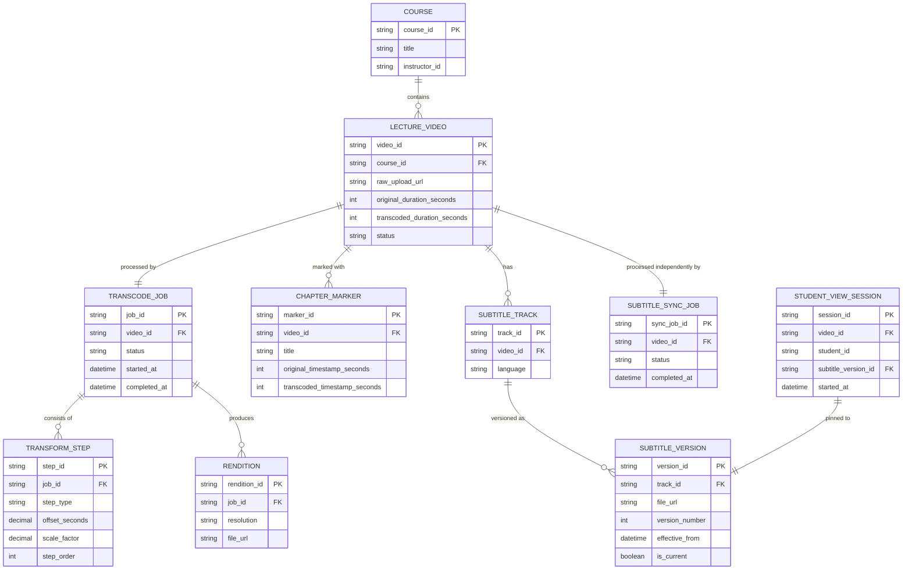

# ERD — Enhance (sau khi đồng bộ timestamp phụ đề/chapter qua pipeline)

Đây là **enhance**: ERD base cộng với các entity phục vụ đúng yêu cầu đề bài — pipeline transcode nhiều bước với từng `TRANSFORM_STEP` được ghi nhận để tính lại timestamp, ánh xạ mốc gốc sang mốc đã transcode cho chapter marker, pipeline phụ đề/chapter chạy song song độc lập với pipeline video chính, và versioning cho phụ đề để không làm gián đoạn học viên đang xem dở. So với base, `CHAPTER_MARKER` nay có cả `original_timestamp_seconds` lẫn `transcoded_timestamp_seconds`, còn `SUBTITLE_FILE` trở thành nhiều `SUBTITLE_VERSION` áp dụng dần theo lượt xem tiếp theo.

