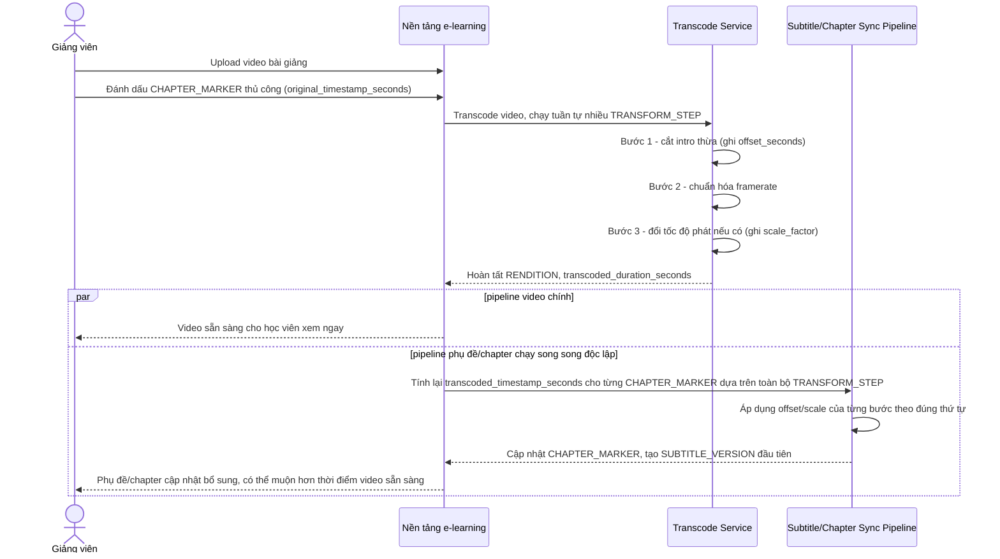

# Sequence Diagram — Enhance: Upload And Transcode Video

Đây là **enhance**, flow transcode thay đổi cốt lõi so với base: pipeline nay chạy nhiều `TRANSFORM_STEP` (cắt intro, chuẩn hóa framerate, đổi tốc độ), mỗi bước ghi nhận offset/scale để tính lại timestamp chapter marker chính xác, đồng thời pipeline phụ đề/chapter chạy song song độc lập nên video có thể sẵn sàng cho học viên trước, không phải chờ phụ đề xử lý xong như một khối với base.

