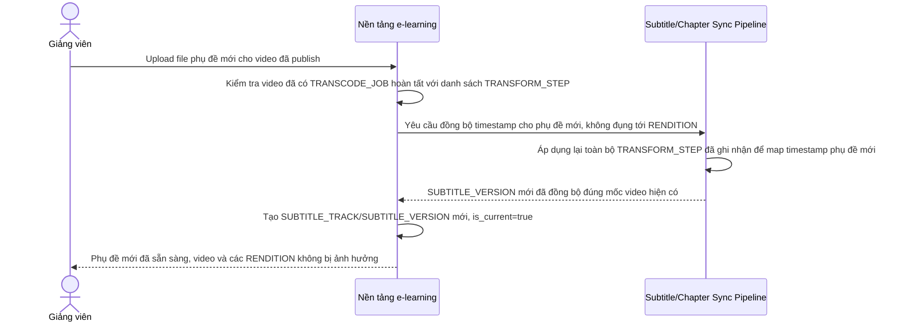

# Sequence Diagram — Enhance: Add Subtitle After Publish

Đây là **enhance**, flow hoàn toàn mới: giảng viên upload phụ đề sau khi video đã transcode xong và publish, việc gắn thêm phụ đề chỉ chạy pipeline phụ đề độc lập, không yêu cầu transcode lại toàn bộ video hay các RENDITION đã có sẵn.

