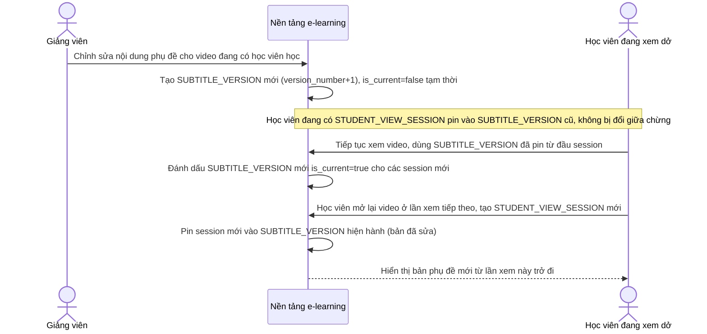

# Sequence Diagram — Enhance: Update Subtitle Mid Course

Đây là **enhance**, flow hoàn toàn mới xử lý khi giảng viên chỉnh sửa phụ đề sau khi khóa học đã có học viên đang học — bản phụ đề cũ không bị thay đổi đột ngột giữa chừng nhờ versioning, bản mới chỉ áp dụng từ lần xem tiếp theo của học viên.

