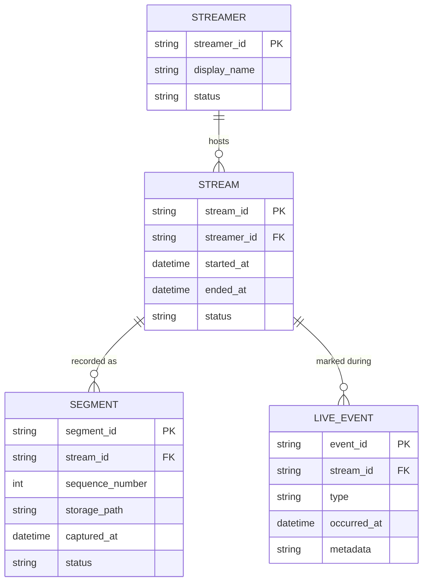

# ERD — Base (trước khi có hậu xử lý VOD)

Đây là **base**: mô hình dữ liệu suy luận cho nền tảng livestream *trước khi* có pipeline hậu xử lý VOD. Đề bài giả định hệ thống đã phát live, đã ghi lại các segment trong lúc live, và đã có cơ chế đánh dấu mốc thời gian quan trọng (donate, highlight) — nếu không có sẵn các entity này thì "ghép segment thành VOD, giữ đúng mốc thời gian" sẽ không có nghĩa. ERD chỉ dựng phần lõi phục vụ ghi hình + đánh dấu sự kiện, không suy diễn thêm các module không liên quan (chat, subscription, monetization...).

