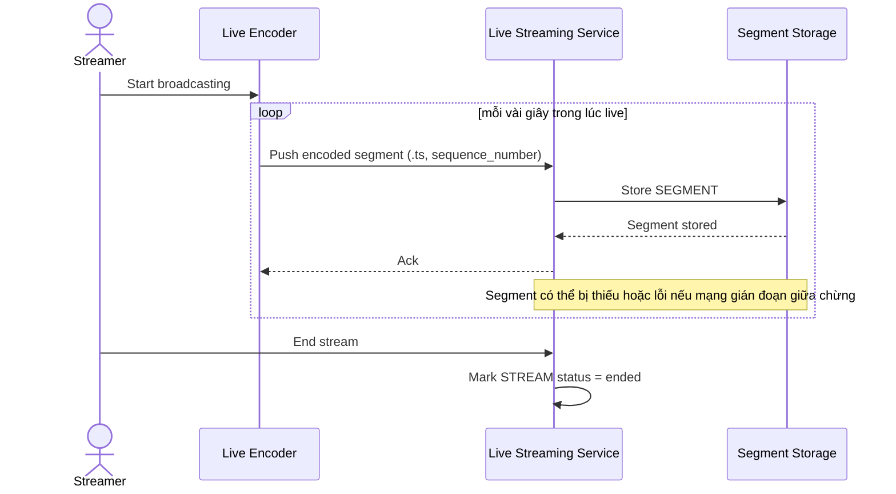

# Sequence Diagram — Base: Live Segment Ingest

Đây là **base**, flow ghi hình trong lúc đang live — tiền đề bắt buộc cho hậu xử lý VOD: chính flow này tạo ra các `SEGMENT` (.ts nhỏ, có thể thiếu/lỗi do gián đoạn mạng) mà sau này phải được ghép lại đúng thứ tự thời gian.

