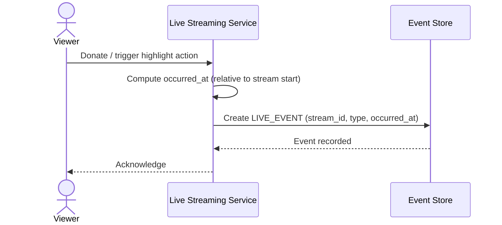

# Sequence Diagram — Base: Mark Live Event

Đây là **base**, flow đánh dấu mốc thời gian quan trọng lúc đang live (donate, highlight) — tiền đề cho yêu cầu "VOD phải giữ đúng các mốc thời gian này sau khi ghép và transcode".

