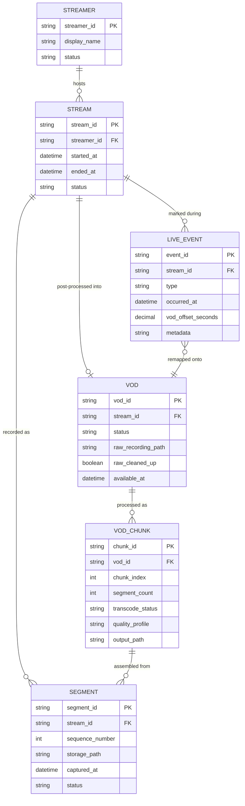

# ERD — Enhance (sau khi có hậu xử lý VOD)

Đây là **enhance**: ERD base cộng với các entity phục vụ đúng 5 yêu cầu của đề bài — ghép segment thành file liên tục (xử lý thiếu/lỗi), transcode lại chất lượng cao theo từng đoạn (chunked), ánh xạ lại mốc thời gian của `LIVE_EVENT` sang VOD, và dọn raw recording sau khi VOD phát được. So với base, `LIVE_EVENT` không đổi cấu trúc nhưng nay có thêm `vod_offset` để trỏ đúng vị trí trên VOD đã ghép/transcode (khác với `occurred_at` gốc trên live).

