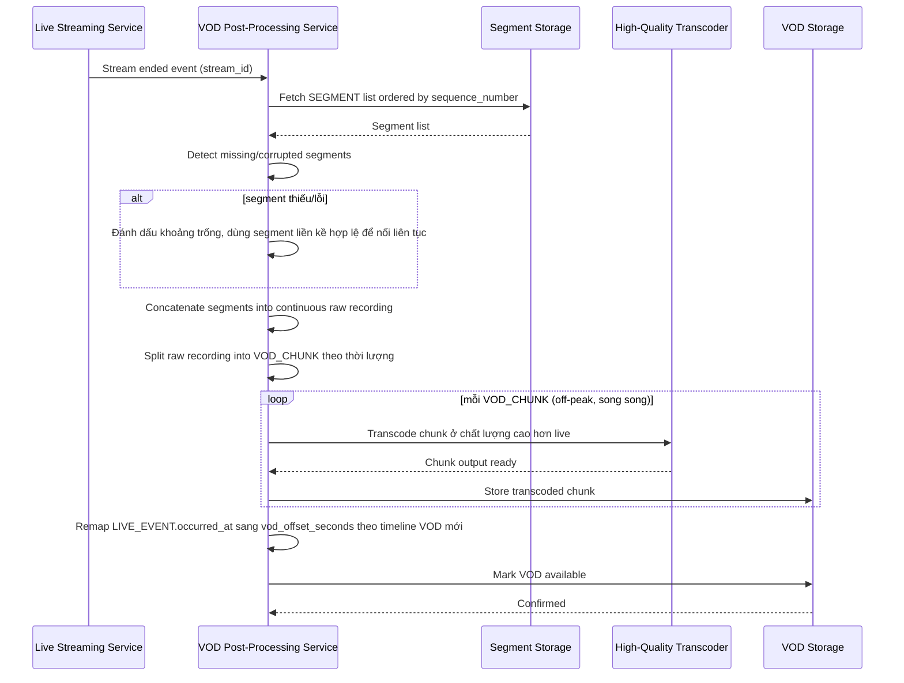

# Sequence Diagram — Enhance: Assemble VOD

Đây là **enhance**, flow chính hoàn toàn mới: khi stream kết thúc (kế thừa `STREAM.status = ended` từ base), hệ thống ghép các `SEGMENT` theo đúng thứ tự thời gian, xử lý segment thiếu/lỗi, rồi transcode lại ở chất lượng cao hơn bản live gốc và ánh xạ lại mốc thời gian của `LIVE_EVENT` sang VOD.

