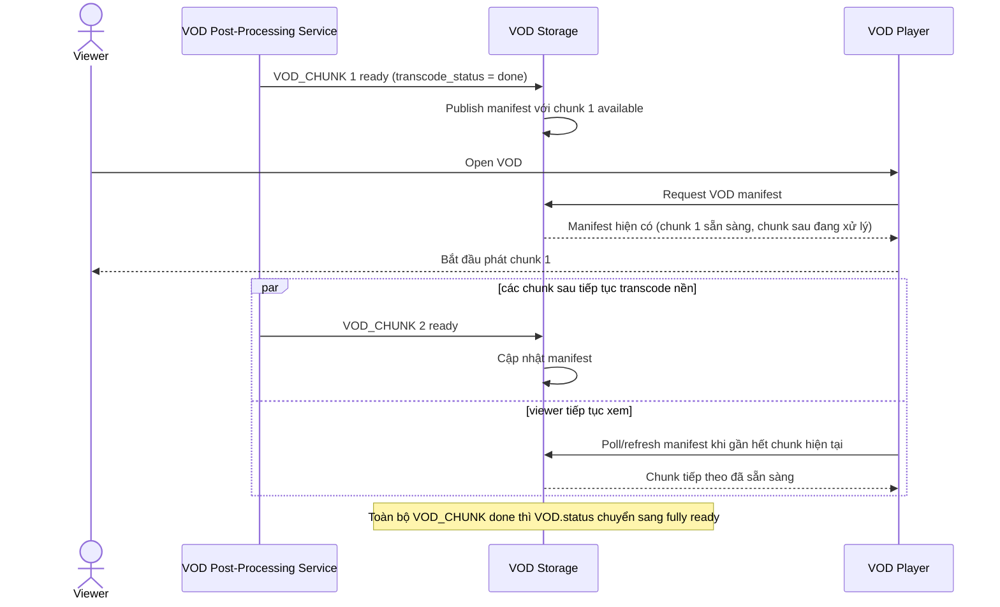

# Sequence Diagram — Enhance: Chunked Progressive Availability

Đây là **enhance**, flow mới phục vụ riêng yêu cầu "stream dài nhiều giờ phải xử lý theo từng đoạn, VOD sẵn sàng dần thay vì chờ toàn bộ". Đây là góc nhìn "viewer xem VOD trong lúc các chunk cuối còn đang xử lý", bổ sung cho flow [5-enhance-assemble-vod-sqd.md](5-enhance-assemble-vod-sqd.md).

