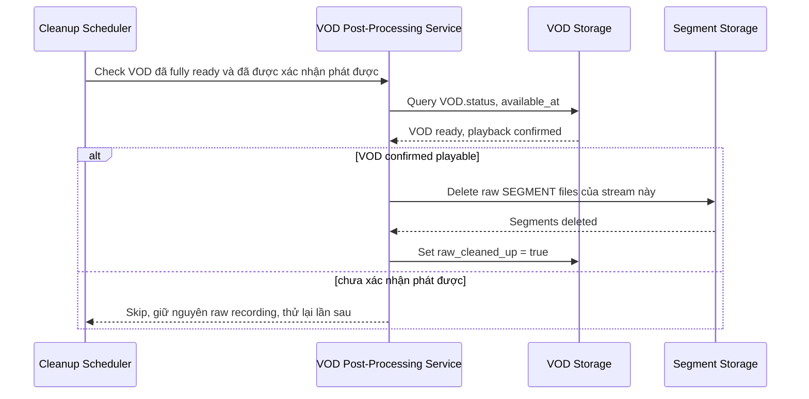

# Sequence Diagram — Enhance: Cleanup Raw Recording

Đây là **enhance**, flow mới xử lý yêu cầu cuối cùng của đề bài: dọn dữ liệu ghi hình thô (segment gốc) sau khi VOD đã tạo thành công và được xác nhận phát được, tránh giữ trùng lặp dữ liệu gây tốn chi phí lưu trữ.

