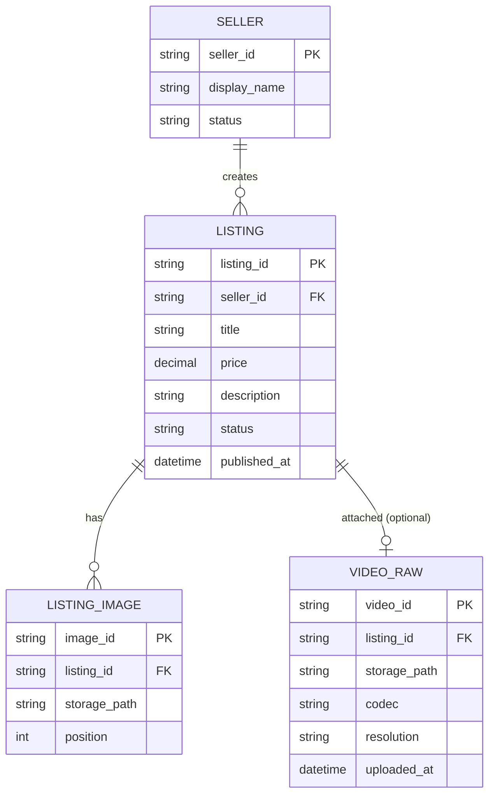

# ERD — Base (trước khi có pipeline chuẩn hóa video)

Đây là **base**: mô hình dữ liệu suy luận cho marketplace *trước khi* có pipeline transcode/chuẩn hóa video sản phẩm. Đề bài giả định seller đã đăng tin bán được với ảnh/thông tin cơ bản, và video là một phần đính kèm được lưu thẳng theo file gốc seller upload — nếu không có sẵn Seller/Listing thì các yêu cầu về "không chặn đăng tin", "chuẩn hóa video", "thay video không tạo khoảng trống" sẽ không có nghĩa. ERD chỉ dựng phần lõi phục vụ đăng tin + video, không suy diễn thêm module thanh toán, chat, đánh giá...

