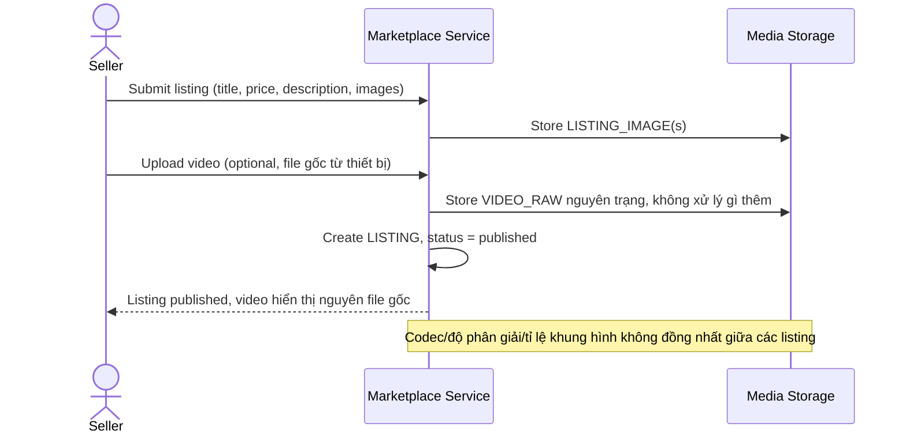

# Sequence Diagram — Base: Create Listing

Đây là **base**, flow seller đăng tin bán — tiền đề bắt buộc cho enhance: chính flow này tạo ra `LISTING` và `VIDEO_RAW` (file gốc chưa qua xử lý), là điểm xuất phát để pipeline chuẩn hóa video sau này gắn vào.

