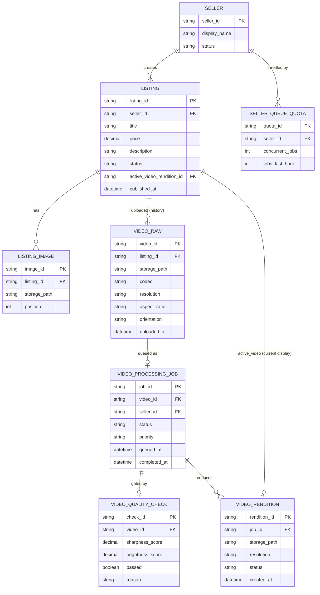

# ERD — Enhance (sau khi có pipeline chuẩn hóa video)

Đây là **enhance**: ERD base cộng với các entity phục vụ đúng 4 yêu cầu của đề bài — chuẩn hóa đa dạng input, xử lý bất đồng bộ không chặn đăng tin, kiểm tra ngưỡng chất lượng đầu vào, và thay video không tạo khoảng trống/lẫn lộn. So với base, `LISTING` không còn phụ thuộc video xử lý xong mới publish được; video giờ đi qua `VIDEO_PROCESSING_JOB` và chỉ khi có `VIDEO_RENDITION` sẵn sàng mới thay thế `active_video_id` một cách atomic.

