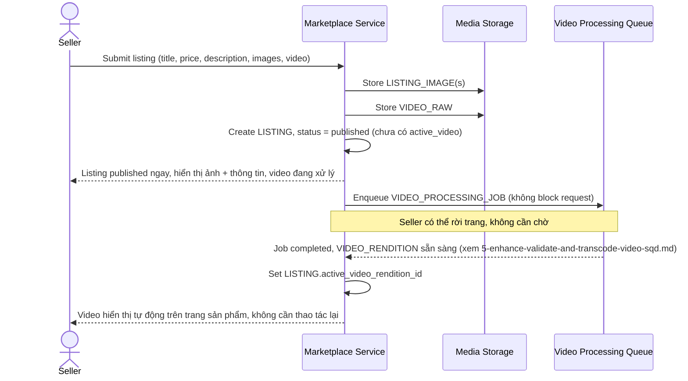

# Sequence Diagram — Enhance: Create Listing

Đây là **enhance**, flow đăng tin bán đã thay đổi so với base ([2-base-create-listing-sqd.md](2-base-create-listing-sqd.md)): listing publish ngay với ảnh/thông tin mà không chờ video xử lý xong; video được đẩy vào hàng đợi xử lý nền và tự động cập nhật hiển thị khi hoàn tất, thay vì hiển thị file gốc chưa chuẩn hóa như ở base.

