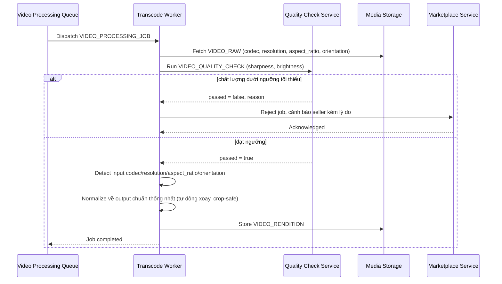

# Sequence Diagram — Enhance: Validate and Transcode Video

Đây là **enhance**, flow mới xử lý một `VIDEO_PROCESSING_JOB`: nhận diện đa dạng codec/độ phân giải/tỉ lệ khung hình/hướng quay, kiểm tra ngưỡng chất lượng tối thiểu để từ chối sớm, rồi mới transcode ra output chuẩn hóa — tránh lãng phí tài nguyên cho video chất lượng quá thấp không thể cải thiện.

