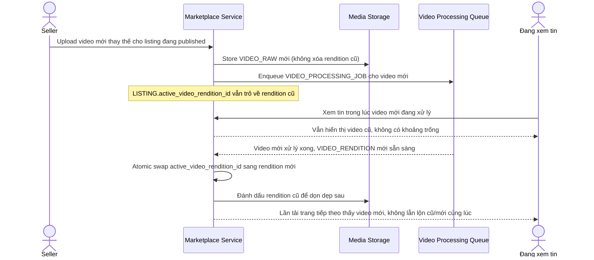

# Sequence Diagram — Enhance: Replace Listing Video

Đây là **enhance**, flow mới hoàn toàn phát sinh từ yêu cầu "seller thay video mới cho tin đang bán chạy mà không tạo khoảng trống hoặc lẫn lộn video cũ/mới cho khách đang xem cùng lúc" — chưa tồn tại ở base vì base chỉ có 1 video gắn cứng theo listing.

