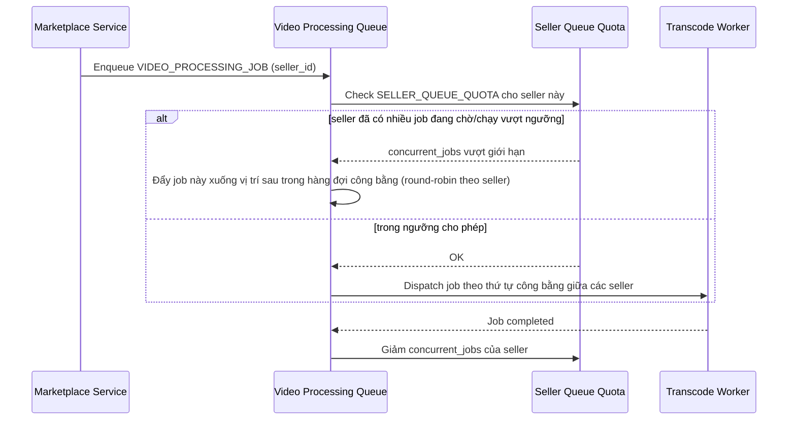

# Sequence Diagram — Enhance: Fair Transcode Queue

Đây là **enhance**, flow mới xử lý yêu cầu công bằng hàng đợi giữa các seller ở giờ cao điểm: tránh một seller upload nhiều video liên tục chiếm hết tài nguyên khiến seller khác chờ lâu bất thường, đồng thời kiểm soát chi phí xử lý khi khối lượng nhỏ lẻ nhưng số lượng lớn.

