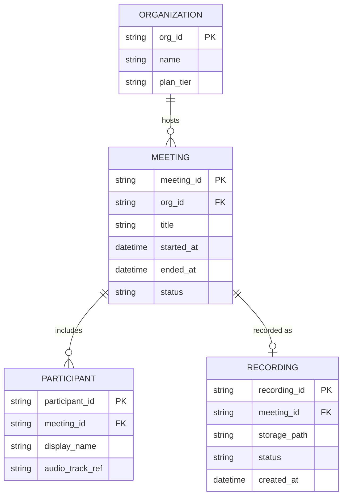

# ERD — Base (trước khi có xử lý ưu tiên tốc độ)

Đây là **base**: mô hình dữ liệu suy luận cho SaaS B2B tổ chức webinar *trước khi* có pipeline xử lý ưu tiên tốc độ và tách nguồn theo người nói. Đề bài giả định hệ thống đã tổ chức được cuộc họp giữa các tổ chức khách hàng và đã ghi lại file recording khi kết thúc — nếu không có sẵn Organization/Meeting/Recording thì yêu cầu "gửi bản ghi nhanh, cô lập theo tổ chức" sẽ không có nghĩa. ERD chỉ dựng phần lõi phục vụ họp + ghi hình, không suy diễn thêm billing, lịch hẹn, CRM...

