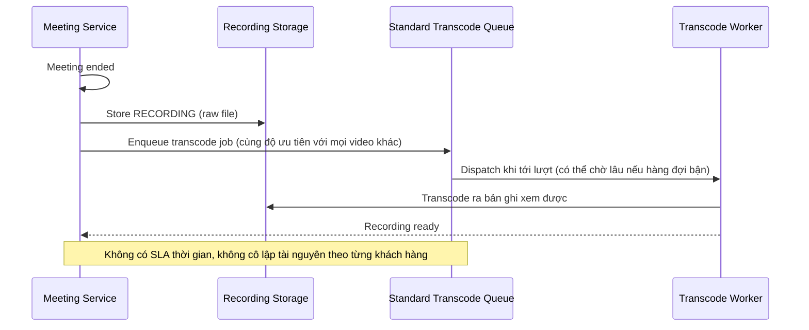

# Sequence Diagram — Base: End Meeting and Process Recording

Đây là **base**, flow xử lý recording khi cuộc họp kết thúc theo cách thông thường (hàng đợi chuẩn, không ưu tiên, không cô lập đặc biệt, không tách nguồn) — tiền đề bắt buộc mà enhance sẽ tăng tốc và bổ sung thêm khả năng.

