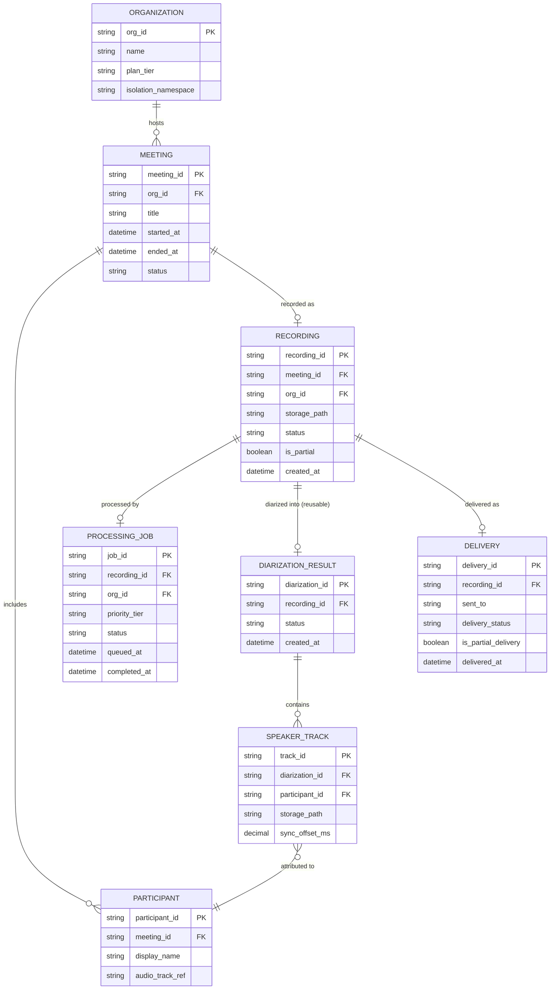

# ERD — Enhance (sau khi có xử lý ưu tiên tốc độ)

Đây là **enhance**: ERD base cộng với các entity phục vụ đúng 4 yêu cầu của đề bài — ưu tiên xử lý tốc độ cao, tách track theo người nói với đồng bộ chính xác, xử lý recording bị lỗi/dừng giữa chừng, và cô lập dữ liệu theo tổ chức. So với base, `RECORDING` nay gắn `priority_tier` và `org_id` tường minh để cô lập hàng đợi/storage, và có thêm `SPEAKER_TRACK`/`DIARIZATION_RESULT` để tái sử dụng kết quả tách nguồn cho các yêu cầu sau.

