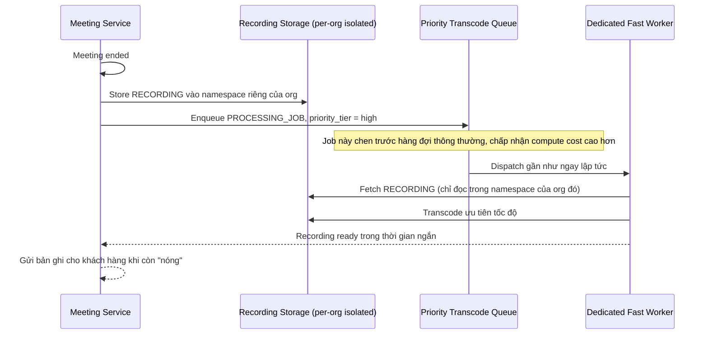

# Sequence Diagram — Enhance: End Meeting and Process Recording

Đây là **enhance**, flow đã thay đổi so với base ([2-base-end-meeting-process-recording-sqd.md](2-base-end-meeting-process-recording-sqd.md)): thay vì vào hàng đợi chuẩn dùng chung, recording nay được xử lý trên priority queue riêng, tài nguyên compute ưu tiên cao hơn (chấp nhận chi phí cao hơn), và job/storage được cô lập theo `org_id` ngay từ đầu.

