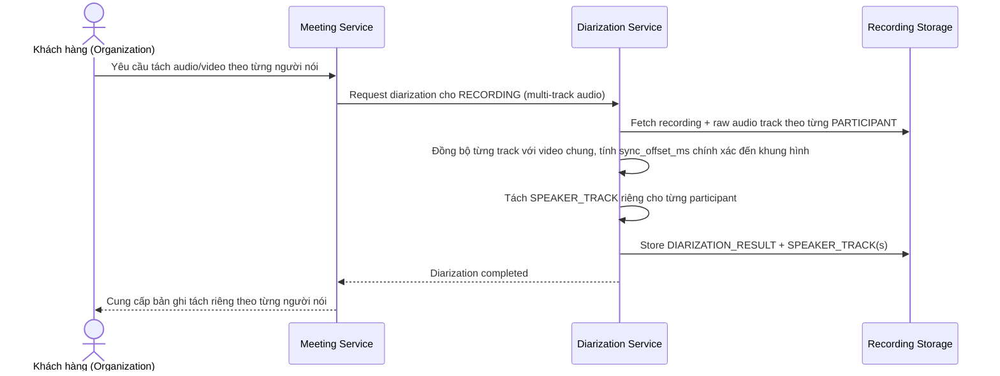

# Sequence Diagram — Enhance: Separate Speaker Tracks

Đây là **enhance**, flow mới hoàn toàn: tách audio/video theo từng người nói khi có yêu cầu, đồng bộ chính xác đến từng khung hình với video chung để tránh audio người này chồng lấn/lệch với hình ảnh người khác. Kết quả `DIARIZATION_RESULT` được lưu lại để flow [6-enhance-reuse-diarization-sqd.md](6-enhance-reuse-diarization-sqd.md) tái sử dụng.

