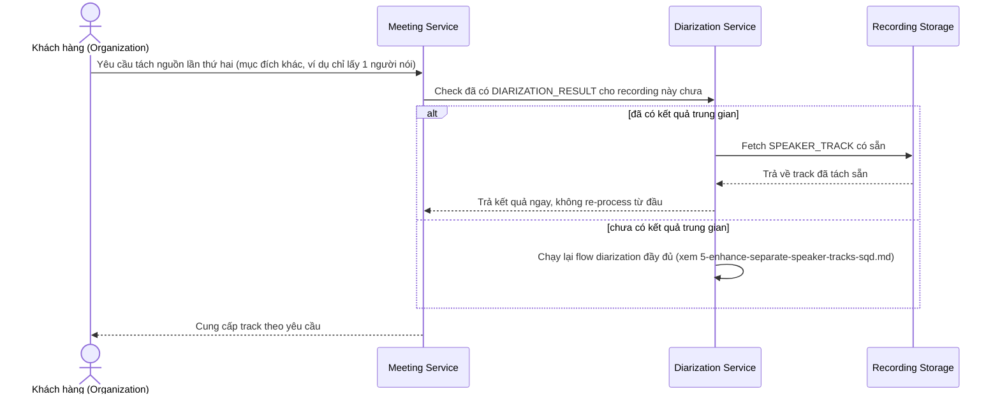

# Sequence Diagram — Enhance: Reuse Diarization Result

Đây là **enhance**, flow mới xử lý yêu cầu "không xử lý lại từ đầu mỗi lần có yêu cầu tách nguồn mới" — tận dụng lại `DIARIZATION_RESULT` đã tạo từ lần xử lý ban đầu ở flow [5-enhance-separate-speaker-tracks-sqd.md](5-enhance-separate-speaker-tracks-sqd.md).

