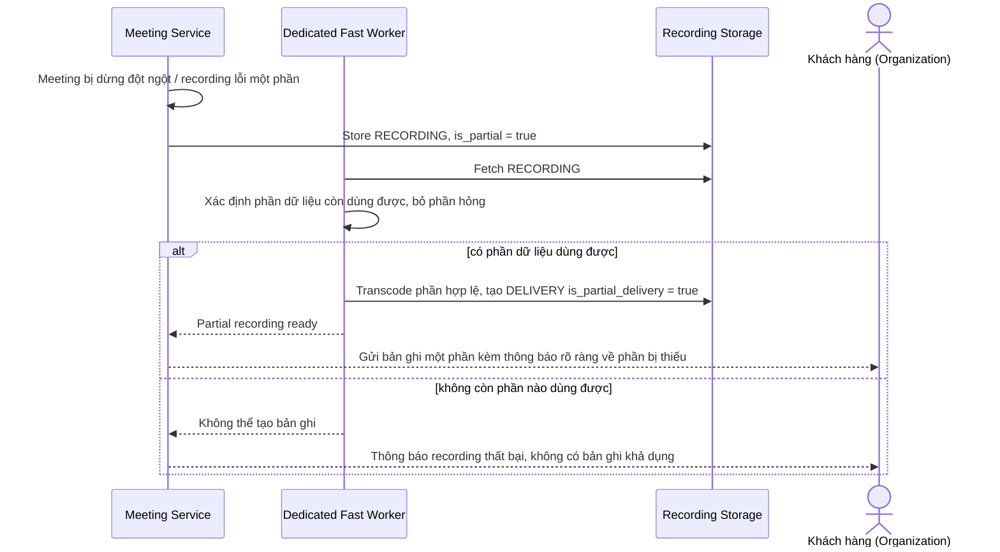

# Sequence Diagram — Enhance: Handle Partial Recording

Đây là **enhance**, flow mới xử lý trường hợp cuộc họp bị dừng đột ngột hoặc file ghi hình lỗi một phần — xử lý phần dữ liệu còn dùng được để gửi bản ghi một phần kèm thông báo rõ ràng, thay vì để khách hàng chờ vô thời hạn.

