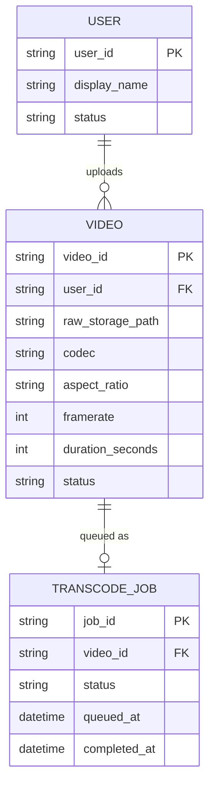

# ERD — Base (trước khi có pipeline transcode tối ưu độ trễ)

Đây là **base**: mô hình dữ liệu suy luận cho app video ngắn *trước khi* có pipeline transcode nhanh, chuẩn hóa, tự scale. Đề bài giả định app đã cho user upload video và có hàng đợi transcode cơ bản — nếu không có sẵn User/Video/TranscodeJob thì các yêu cầu về SLA, chuẩn hóa tỉ lệ khung hình, tự scale, hủy job sẽ không có nghĩa. ERD chỉ dựng phần lõi phục vụ upload + transcode, không suy diễn thêm follow, like, comment...

