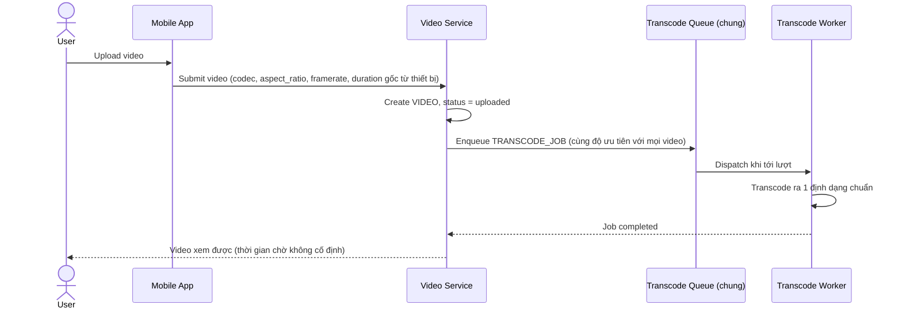

# Sequence Diagram — Base: Upload and Transcode Video

Đây là **base**, flow upload và transcode thông thường (không SLA riêng, không kiểm tra sơ bộ, không autoscale, không hủy job) — tiền đề bắt buộc mà enhance sẽ tối ưu độ trễ và bổ sung các cơ chế vận hành.

