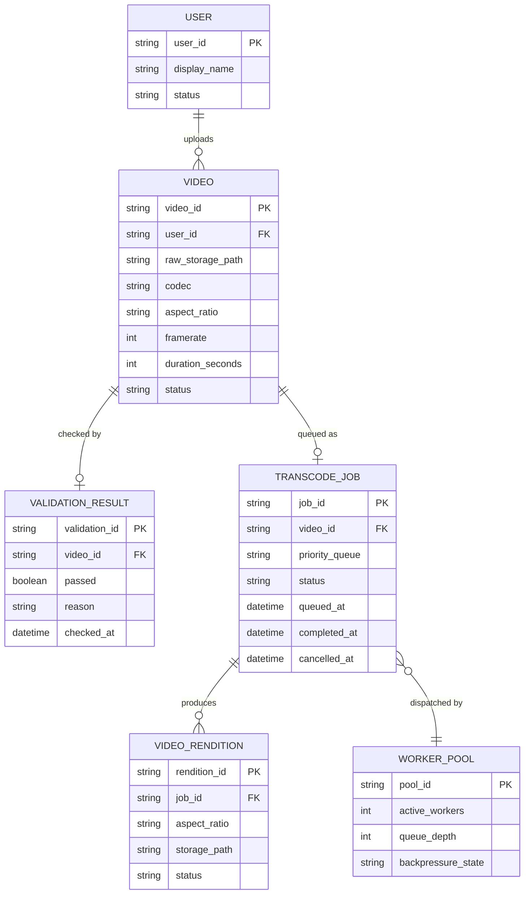

# ERD — Enhance (sau khi tối ưu độ trễ end-to-end)

Đây là **enhance**: ERD base cộng với các entity phục vụ đúng 5 yêu cầu của đề bài — hàng đợi ưu tiên SLA riêng, chuẩn hóa nhiều tỉ lệ khung hình, kiểm tra sơ bộ trước khi vào hàng đợi, tự scale/backpressure, và hủy job khi video bị xóa. So với base, `TRANSCODE_JOB` nay bắt buộc qua `VALIDATION_RESULT` trước khi được enqueue, và có thêm `priority_queue`/`status = cancelled` để phản ánh vòng đời mới.

