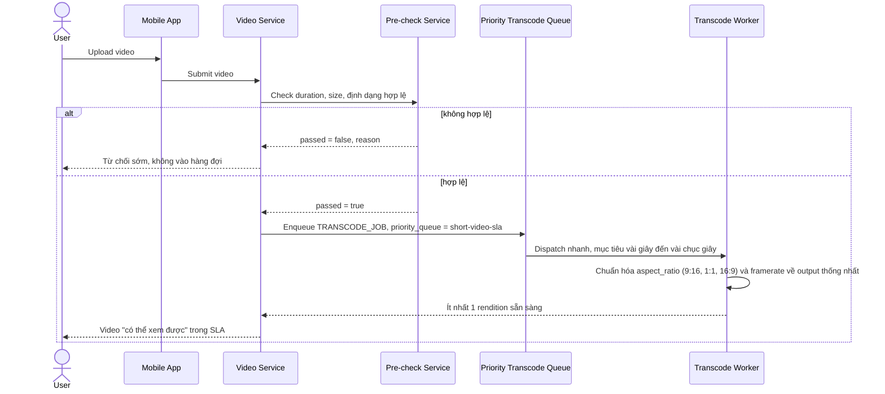

# Sequence Diagram — Enhance: Upload and Transcode Video

Đây là **enhance**, flow đã thay đổi so với base ([2-base-upload-and-transcode-video-sqd.md](2-base-upload-and-transcode-video-sqd.md)): video nay đi qua kiểm tra sơ bộ trước khi vào hàng đợi riêng ưu tiên SLA, và được chuẩn hóa nhiều tỉ lệ khung hình/framerate khác nhau về cùng chuẩn output thay vì transcode 1 định dạng chung như base.

