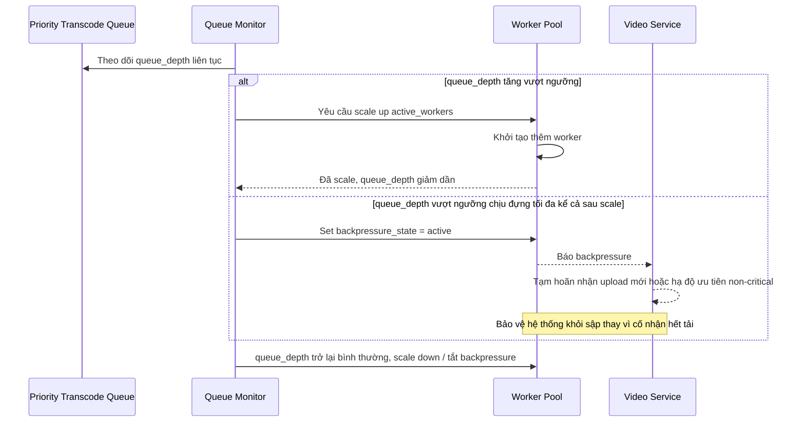

# Sequence Diagram — Enhance: Autoscale and Backpressure

Đây là **enhance**, flow mới hoàn toàn phục vụ yêu cầu chịu tải khi upload tăng đột biến (viral moment, giờ cao điểm): tự động scale worker theo độ sâu hàng đợi và có cơ chế backpressure để không sập toàn hệ thống.

