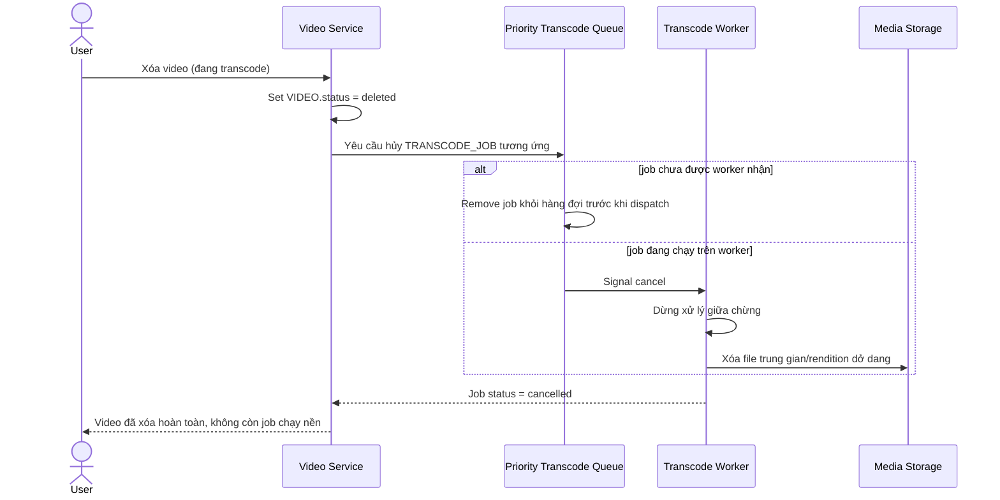

# Sequence Diagram — Enhance: Cancel Transcode on Delete

Đây là **enhance**, flow mới xử lý trường hợp user xóa video trong lúc đang transcode — hủy job giữa chừng và dọn sạch file trung gian, không tiếp tục xử lý lãng phí tài nguyên worker.

