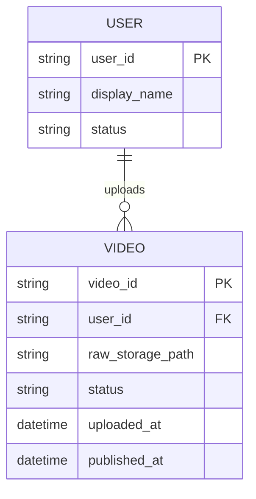

# ERD — Base (trước khi có pipeline transcode đa độ phân giải)

Đây là **base**: mô hình dữ liệu suy luận cho nền tảng chia sẻ video *trước khi* có pipeline upload resumable, multi-resolution, progressive availability. Đề bài giả định nền tảng đã cho user upload và xem lại video ở dạng đơn giản — nếu không có sẵn User/Video thì các yêu cầu về chunked upload, retry, cleanup sẽ không có nghĩa. ERD chỉ dựng phần lõi phục vụ upload + phát video, không suy diễn thêm subscription, comment, recommendation...

Ghi chú giả định: base là dạng upload nguyên khối (không resumable) và transcode 1 độ phân giải duy nhất, publish chỉ khi xử lý xong hoàn toàn — đây là điểm khởi đầu hợp lý nhất để so sánh với các yêu cầu nâng cấp toàn diện của đề bài.
