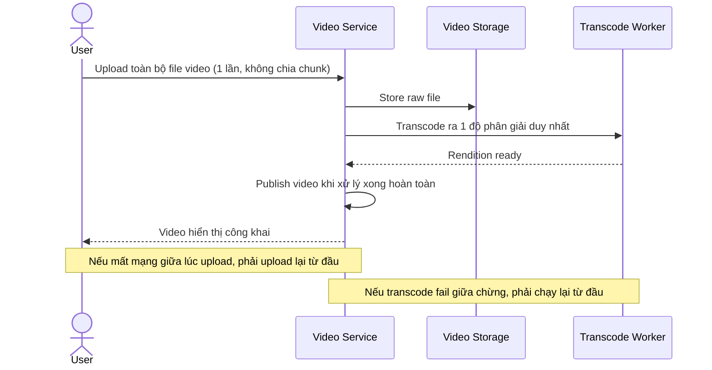

# Sequence Diagram — Base: Upload and Publish Video

Đây là **base**, flow upload và publish đơn giản (nguyên khối, 1 độ phân giải, publish khi xong toàn bộ) — tiền đề bắt buộc mà enhance sẽ nâng cấp thành resumable/multi-resolution/progressive.

