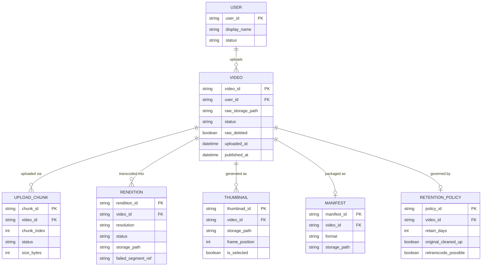

# ERD — Enhance (sau khi có pipeline transcode đa độ phân giải)

Đây là **enhance**: ERD base cộng với các entity phục vụ đúng 6 yêu cầu của đề bài — resumable upload theo chunk, transcode song song nhiều độ phân giải, sinh thumbnail + manifest HLS/DASH, retry đúng phần thiếu, progressive availability, và cleanup có khả năng re-transcode. So với base, `VIDEO` không còn gắn 1 file kết quả duy nhất mà tách thành nhiều `RENDITION` độc lập, publish được ngay khi có rendition đầu tiên thay vì chờ toàn bộ.

