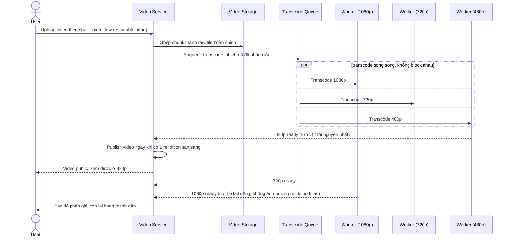

# Sequence Diagram — Enhance: Upload and Publish Video

Đây là **enhance**, flow đã thay đổi so với base ([2-base-upload-and-publish-video-sqd.md](2-base-upload-and-publish-video-sqd.md)): upload nay chia chunk (xem chi tiết resume ở [5-enhance-resumable-chunked-upload-sqd.md](5-enhance-resumable-chunked-upload-sqd.md)), transcode nhiều độ phân giải song song không chặn nhau, và video publish ngay khi có rendition đầu tiên thay vì chờ toàn bộ như base.

