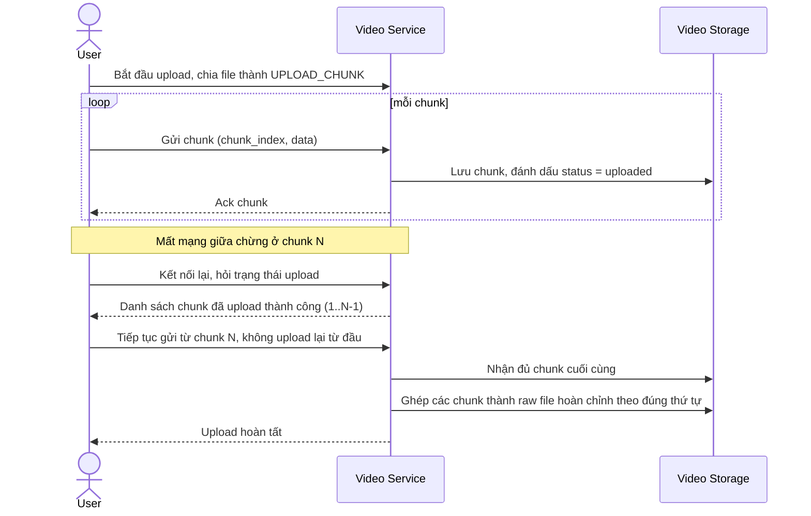

# Sequence Diagram — Enhance: Resumable Chunked Upload

Đây là **enhance**, flow mới hoàn toàn phục vụ yêu cầu upload file lớn (nhiều GB) bằng chunked/resumable upload, tiếp tục được nếu mất mạng giữa chừng — chưa tồn tại ở base vì base upload nguyên khối.

