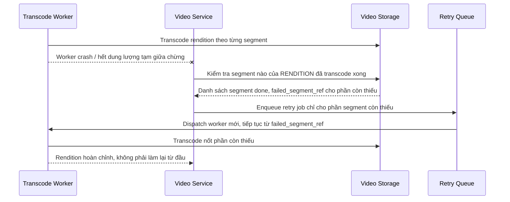

# Sequence Diagram — Enhance: Retry Failed Transcode

Đây là **enhance**, flow mới xử lý yêu cầu "nếu job transcode fail giữa chừng, phải retry đúng phần việc còn thiếu, không transcode lại từ đầu toàn bộ video".

