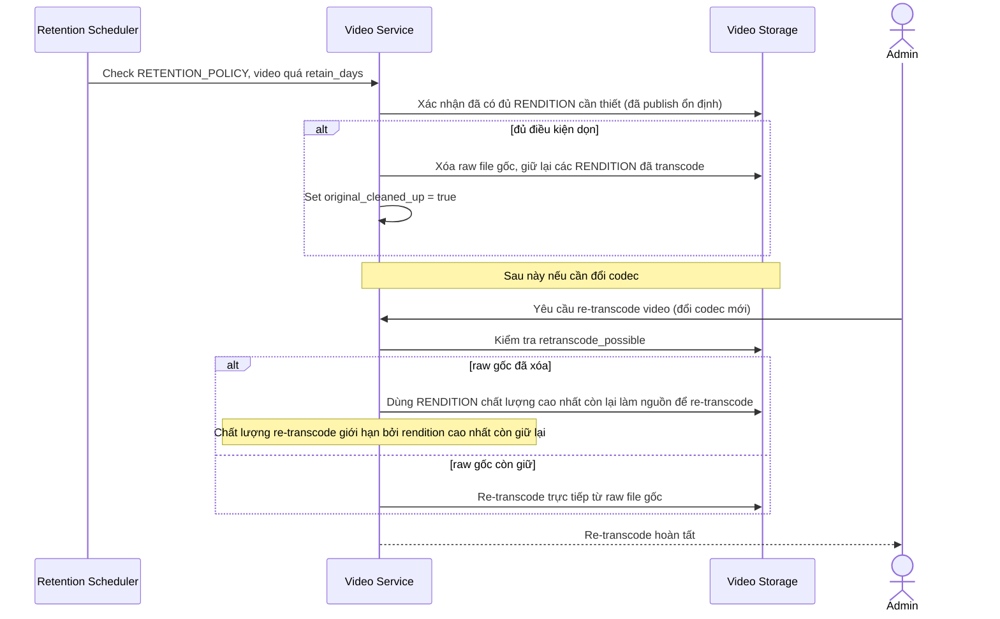

# Sequence Diagram — Enhance: Cleanup and Retranscode Original

Đây là **enhance**, flow mới xử lý yêu cầu dọn file gốc/file tạm sau X ngày để tối ưu chi phí lưu trữ, nhưng vẫn giữ khả năng re-transcode nếu cần đổi codec sau này.

