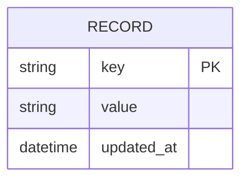

# ERD — Base (trước khi có WAL)

Đây là **base**: mô hình dữ liệu suy luận cho storage engine đơn giản *trước khi* có WAL. Đề bài giả định đã có một cấu trúc dữ liệu chính (in-memory hoặc B-tree trên đĩa) lưu record theo key — nếu không có sẵn cấu trúc này thì "ghi WAL trước khi áp dụng vào cấu trúc dữ liệu chính" sẽ không có nghĩa. ERD chỉ dựng đúng phần lõi lưu trữ key-value, không suy diễn thêm index phụ, schema, transaction đa bảng...

Ghi chú: ở base, `RECORD` được ghi/sửa trực tiếp vào cấu trúc dữ liệu chính (in-memory hoặc B-tree), không qua bước log tuần tự nào — đây chính là điểm yếu mà WAL ở phần enhance khắc phục.
