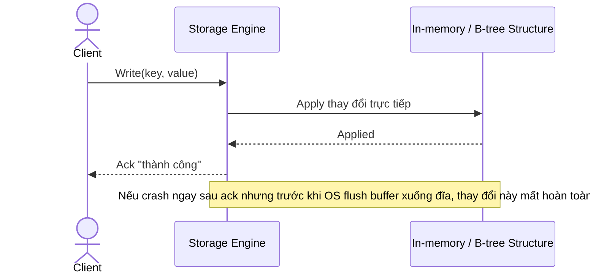

# Sequence Diagram — Base: Write Record

Đây là **base**, flow ghi dữ liệu trực tiếp vào cấu trúc chính, không qua log tuần tự nào — tiền đề để thấy rõ rủi ro mất dữ liệu khi crash, chính là lý do đề bài yêu cầu thêm WAL.

