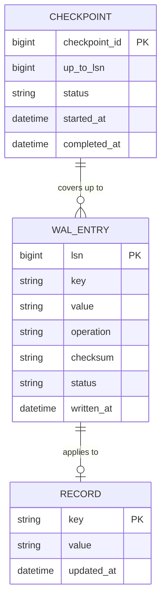

# ERD — Enhance (sau khi có WAL)

Đây là **enhance**: ERD base cộng với các entity phục vụ đúng 5 yêu cầu của đề bài — ghi WAL fsync trước khi ack, replay đúng thứ tự sau crash, phát hiện torn write bằng checksum, checkpoint định kỳ an toàn, và đo recovery time theo kích thước WAL. So với base, `RECORD` nay chỉ được cập nhật thông qua `WAL_ENTRY` đã fsync thành công, không còn ghi trực tiếp.

