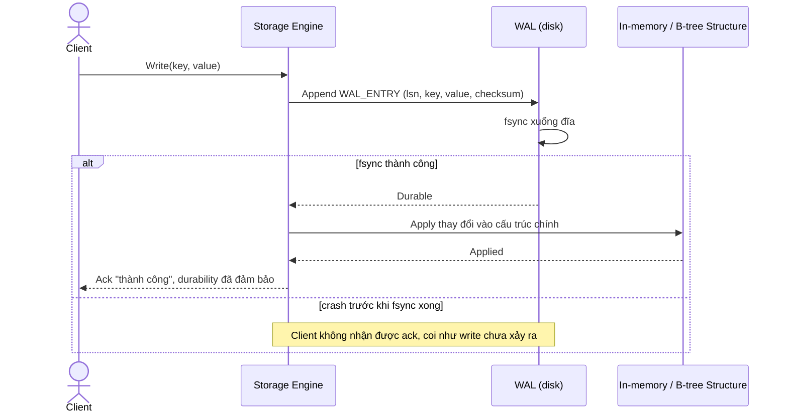

# Sequence Diagram — Enhance: Write Record

Đây là **enhance**, flow ghi dữ liệu đã thay đổi so với base ([2-base-write-record-sqd.md](2-base-write-record-sqd.md)): mọi write nay phải ghi `WAL_ENTRY` và fsync xuống đĩa thành công trước khi trả ack, chỉ sau đó mới áp dụng vào cấu trúc dữ liệu chính, thay vì ghi trực tiếp như base.

