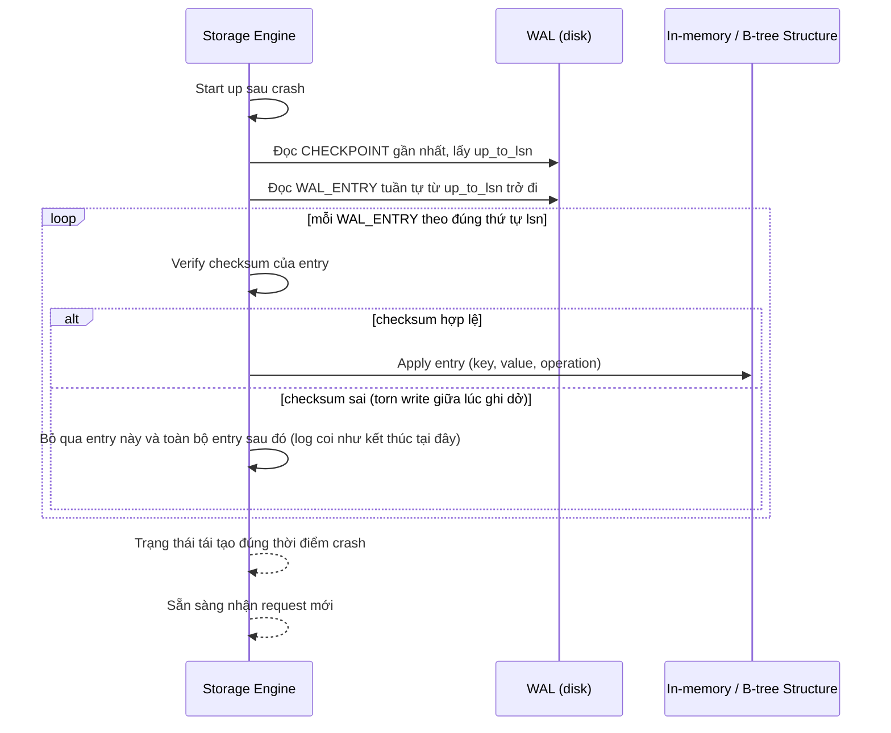

# Sequence Diagram — Enhance: Crash Recovery Replay

Đây là **enhance**, flow mới hoàn toàn: khi engine khởi động lại sau crash, replay WAL từ checkpoint gần nhất theo đúng thứ tự, phát hiện và bỏ qua entry bị torn write nhờ checksum.

