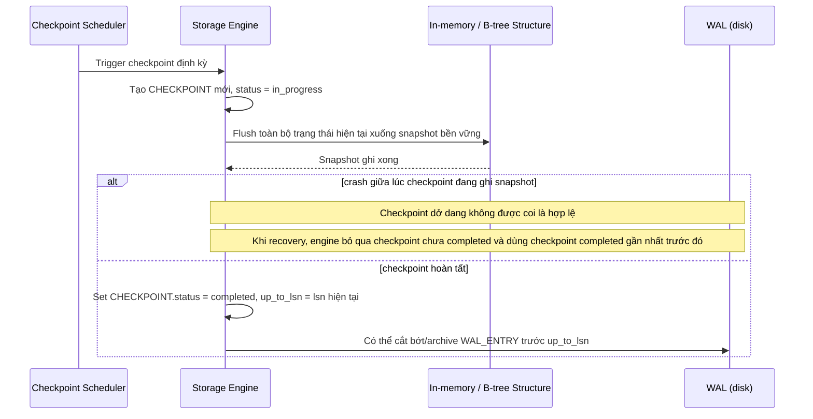

# Sequence Diagram — Enhance: Periodic Checkpoint

Đây là **enhance**, flow mới xử lý yêu cầu checkpoint định kỳ để giới hạn độ dài WAL cần replay, và phải an toàn nếu crash xảy ra giữa lúc đang checkpoint.

