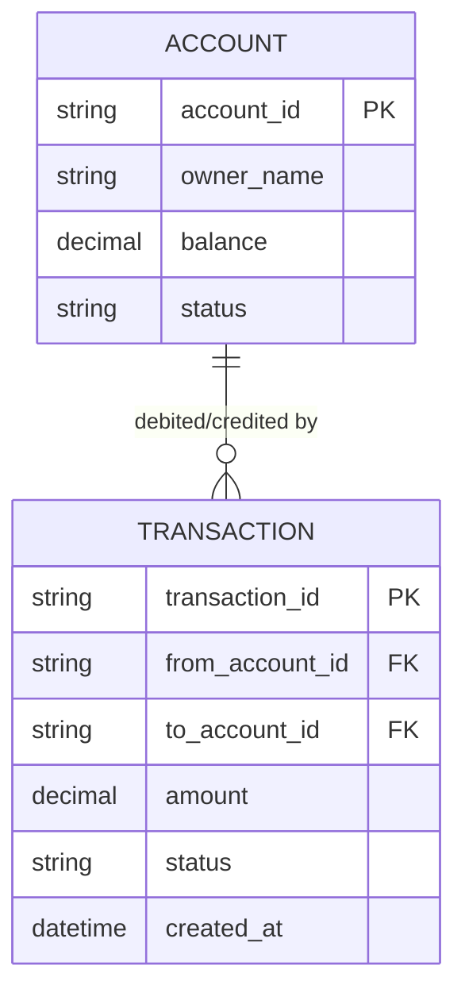

# ERD — Base (trước khi có WAL durability cao)

Đây là **base**: mô hình dữ liệu suy luận cho app ngân hàng số *trước khi* có WAL đảm bảo durability cao nhất. Đề bài giả định đã có Account và luồng ghi Transaction chuyển tiền cập nhật số dư — nếu không có sẵn các entity này thì yêu cầu "mọi thay đổi số dư phải ghi WAL" sẽ không có nghĩa. ERD chỉ dựng phần lõi phục vụ chuyển tiền, không suy diễn thêm thẻ, tiết kiệm, KYC...

Ghi chú: ở base, transaction được ghi thẳng vào DB/ledger thông thường, không có đảm bảo ghi đồng thời nhiều thiết bị/đĩa, không checksum, không atomic rõ ràng — đây chính là các lỗ hổng mà WAL ở phần enhance khắc phục.
