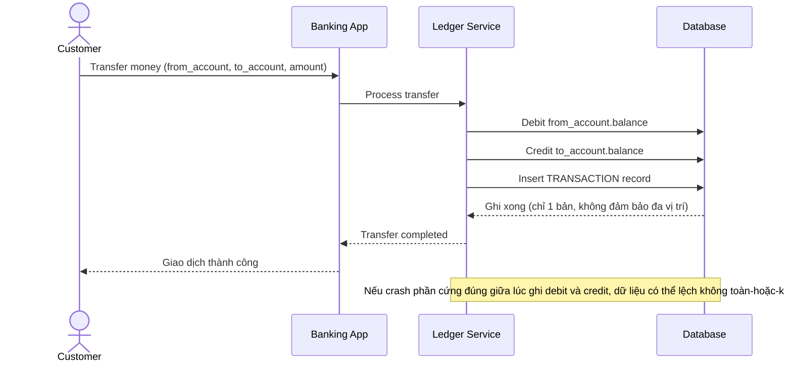

# Sequence Diagram — Base: Transfer Money

Đây là **base**, flow chuyển tiền cơ bản: trừ tiền người gửi, cộng tiền người nhận, ghi thẳng vào DB — không có đảm bảo durability đa vị trí, không checksum, không atomic rõ ràng giữa 2 vế của giao dịch.

