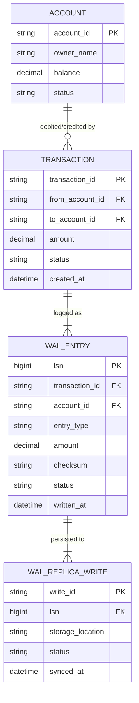

# ERD — Enhance (sau khi có WAL durability cao)

Đây là **enhance**: ERD base cộng với các entity phục vụ đúng 5 yêu cầu của đề bài — ghi WAL ra ít nhất 2 vị trí độc lập trước khi ack, checksum để phát hiện corrupt, recovery atomic toàn-hoặc-không, audit trail đầy đủ, và đo RPO/RTO. So với base, `TRANSACTION` nay chỉ được coi là hoàn tất sau khi cả hai `WAL_ENTRY` (debit + credit) đã ghi thành công ở `WAL_REPLICA_WRITE` trên tối thiểu 2 vị trí vật lý.

