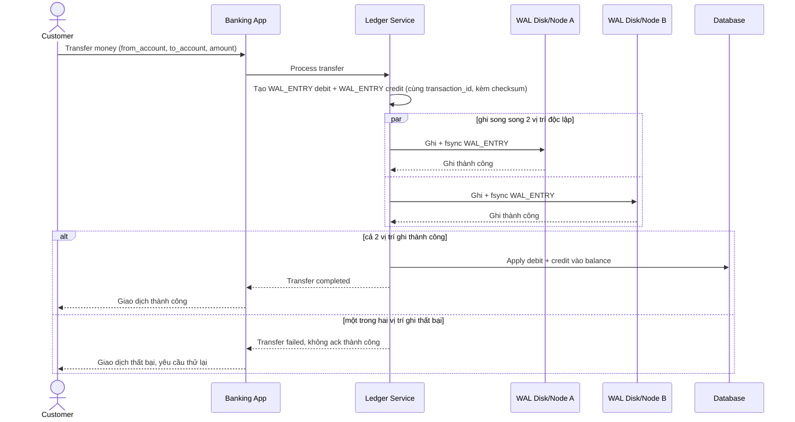

# Sequence Diagram — Enhance: Transfer Money

Đây là **enhance**, flow chuyển tiền đã thay đổi so với base ([2-base-transfer-money-sqd.md](2-base-transfer-money-sqd.md)): trước khi trả kết quả "giao dịch thành công", cả hai `WAL_ENTRY` (debit và credit) phải được ghi thành công ra ít nhất 2 vị trí lưu trữ vật lý độc lập, thay vì ghi thẳng 1 bản vào DB như base.

