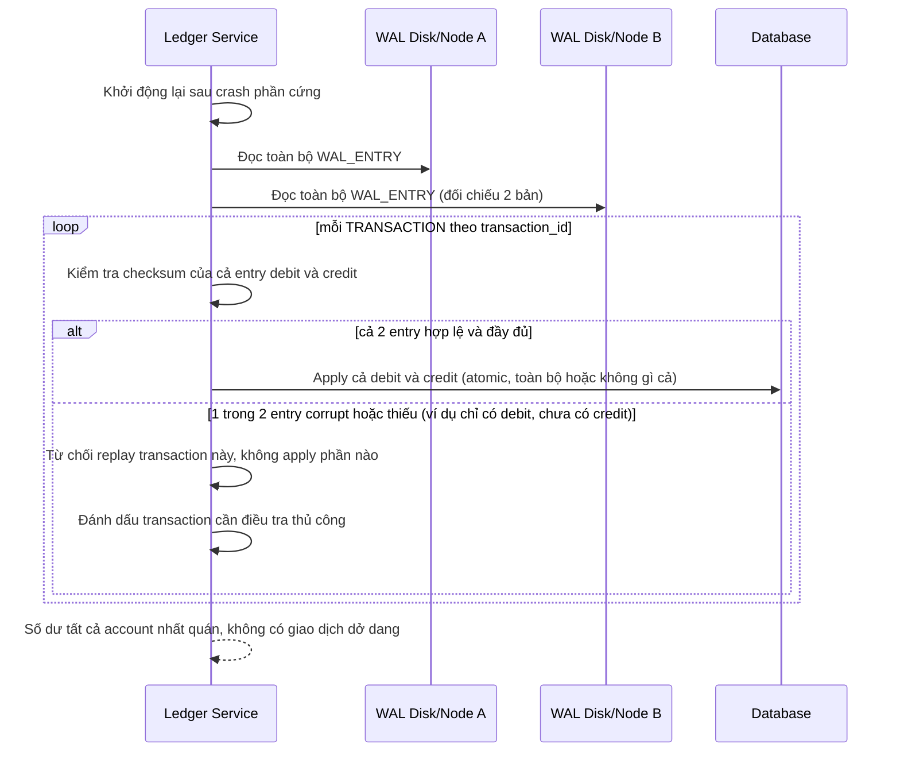

# Sequence Diagram — Enhance: Crash Recovery Atomic Replay

Đây là **enhance**, flow mới hoàn toàn: recovery sau crash phải toàn-hoặc-không cho mỗi transaction, và mỗi entry phải qua kiểm tra checksum trước khi apply, không âm thầm ghi sai số dư.

