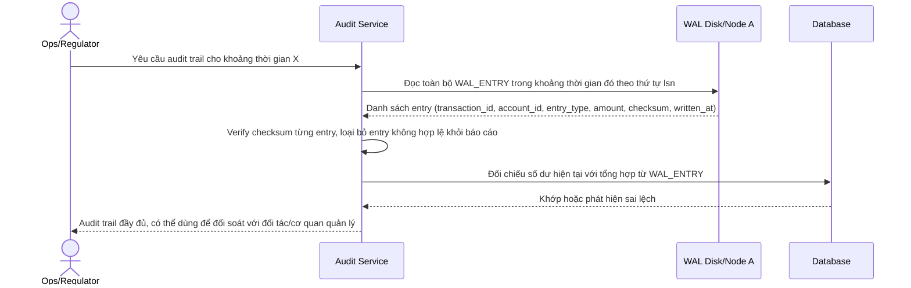

# Sequence Diagram — Enhance: Generate Audit Trail

Đây là **enhance**, flow mới xử lý yêu cầu log đủ thông tin để replay ra audit trail đầy đủ, phục vụ đối soát với ngân hàng đối tác/cơ quan quản lý sau này.

